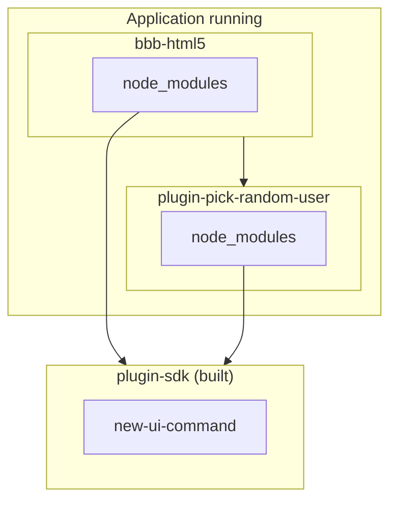

# BigBlueButton SDK for HTML5 Client Plugins

This repository contains the SDK for developing BigBlueButton plugins. Plugins are React components that can be loaded from external sources by the BigBlueButton HTML5 client to extend its functionalities.

## Overview

An overview of the main features and capabilities can be found [here](https://github.com/bigbluebutton/plugins/blob/main/README.md#capabilities-and-technical-details). However, please note that these depend on the version of BigBlueButton you are developing for.

### Plugin Versioning

This repository contains the SDK code used to develop BigBlueButton plugins.

Please be aware that we have a separate branch for each version of the SDK. This ensures that everything merged into a branch is compatible with the corresponding version of the BigBlueButton core. As of now, here’s the correspondence between the branches, SDK versions, and BigBlueButton core versions:

| Repository Branch | Plugin-SDK Version | BigBlueButton Core Version |
|------------------|--------------------|----------------------------|
| v0.0.x           | v0.0.x             | v3.0.x                     |
| v0.1.x           | v0.1.x             | v3.1.x                     |

Note that this branch (`main`) does not contain any code, as it is used only for basic documentation. For more information about the plugin API features, see the documentation (`readme` files) within the specific branch you are interested in. We separate the branches because, going forward, `v0.1.x` is becoming more and more different from `v0.0.x`.

If you have any suggestions, requirements, or questions, don’t hesitate to contact us.

With that said, here follows the basic documentation of the Plugin SDK:

### Building a Hello-World Plugin Example

This section will guide you through all the steps needed to create a functional plugin—or at least a solid starting point. In this example, the plugin will add an option to the **Options** dropdown menu (the three dots in the top right-hand corner of the client). When clicked, it will trigger a popup displaying the message `"hello world"`.

---

**1. Choose the Right SDK Version**

First, select the appropriate version of the `bigbluebutton-html-plugin-sdk` based on your BigBlueButton server. Refer to the section [Plugin Versioning](#plugin-versioning) for guidance. You’ll need this information later in the tutorial.

---

**2. Use the Official Plugin Template**

Start with the plugin template provided by the BigBlueButton organization, available at:

➡️ [https://github.com/bigbluebutton/plugin-template](https://github.com/bigbluebutton/plugin-template)

While it's possible to build a plugin from scratch, doing so requires specific configurations in files like `package.json` and `webpack.config.js` (if you're using Webpack), which can be tricky to get right. The official template saves time by providing all the necessary boilerplate so you can focus on writing your plugin logic.

To get started:

- Visit the template page and click the **"Use this template"** button to create your own repository under your GitHub account.


---

**3. Clone the Repository and Start Coding**

Clone your new repository locally and begin making the necessary modifications. Follow the sub-steps below:

**🔧 Set Up the Plugin Name**

- Name your plugin. For this tutorial, we’ll use `plugin-hello-world`, but you’re free to choose another name.
- Also define the PascalCase version of the name (e.g., `PluginHelloWorld`) for configuration files.

**📝 Update Placeholders**

Replace all `<plugin-name>` placeholders in the following files:

- `package.json`
- `webpack.config.js` (use PascalCase)
- `manifest.json` (use PascalCase)

**🔍 Check SDK Version Compatibility**

Go to the [bigbluebutton-html-plugin-sdk NPM page](https://www.npmjs.com/package/bigbluebutton-html-plugin-sdk) and check which version is compatible with your BigBlueButton server.

> For example, if your server uses BigBlueButton 3.0, you might need the latest `0.0.x` version which is currently `0.0.73`.

Update your `package.json` accordingly and then run:

```bash
npm install
```

---

**📁 Create the Plugin Component**

Create a folder and component file:

```bash
mkdir src/plugin-hello-world
touch src/plugin-hello-world/component.tsx
```

Now add the following code to `component.tsx`:

```tsx
import { BbbPluginSdk, OptionsDropdownOption, pluginLogger } from 'bigbluebutton-html-plugin-sdk';
import * as React from 'react';
import { useEffect } from 'react';

interface PluginHelloWorldProps {
  pluginUuid: string;
}

function PluginHelloWorld({ pluginUuid }: PluginHelloWorldProps): React.ReactElement {
  BbbPluginSdk.initialize(pluginUuid);
  const pluginApi = BbbPluginSdk.getPluginApi(pluginUuid);

    useEffect(() => {
      pluginApi.setOptionsDropdownItems([
        new OptionsDropdownOption({
          label: 'Click me',
          icon: 'user',
          onClick: () => {
            alert('Hello, World!');
            pluginLogger.info('Option has been clicked');
          },
        }),
      ]);
    }, []);

  return null;
}

export default PluginHelloWorld;
```

- The `useEffect` hook ensures the plugin initializes only once.
- `setOptionsDropdownItems` adds the new button to the dropdown menu.
- The `onClick` handler triggers a simple popup.

---

**4. Update `index.tsx`**

Paste the following code into your `index.tsx` file:

```tsx
import * as React from 'react';
import * as ReactDOM from 'react-dom/client';
import PluginHelloWorld from './plugin-hello-world/component';

const uuid = document.currentScript?.getAttribute('uuid') || 'root';
const pluginName = document.currentScript?.getAttribute('pluginName') || 'plugin';

const root = ReactDOM.createRoot(document.getElementById(uuid));
root.render(
  <PluginHelloWorld
    pluginUuid={uuid}
    pluginName={pluginName}
  />
);
```

---

**✅ That’s it!**

You’ve successfully created your first plugin! 🎉

To run the plugin, choose one of the following modes:

- [Running the plugin from source (development)](#running-the-plugin-from-source)
- [Building the plugin for production](#building-the-plugin-production)

---

Feel free to reach out to us for additional information or help.

## Usage

This is a general instruction on how to use a plugin.
For a detailed configuration example of each use case,
have a look at the READMEs in the respective samples folders inside the respective versioned branch of this SDK repository.

### Running the Plugin from Source

*Quick comment for those using Firefox to test locally development:* you are going to see ahead that we recommend using ngrok to proxy the calls to your local server in order to test your plugin in nearly any BigBlueButton server out there. There is only one minor issue with this: the Ngrok's free plan has an interstitial page that loads the first time you interact with their proxy server and to bypass this page after the first interaction, they set a cookie called `abuse_interstitial`.

The only problem in this is that Firefox is a bit strict with their cookies policy and this can cause your plugin to not load. To solve this minor problem, one can set different cookies preferences just to test the plugin in dev mode, and then can return the configurations back to normal. To do that, follow the instructions ahead:

- Access the "about:preferences" in your Firefox;
- Search for the word cookie in the search input (within the preferences page);
- There you'll find some of the default configuration on cookies. Amongst those, you'll see three options on cookies preferences: Standard (usually the default), Strict and Custom;
- For bbb-plugin testing purposes, you'll need to select "custom", then inside this selection, there are some checkboxes with some selection-dropdown for you to choose your preferences. You are going to change just the first one with checkbox labeled "Cookies" to "Cookies from unvisited websites" (since there is no need to block cookies from the already visited websites, such as your ngrok proxy, for this example, of course);
- Once changed, firefox will ask you to reload all the tabs, do that so you apply the changes.

And there you have it. One last comment: This happens for Firefox, other browsers might be as strict, we don't know for sure. With Chrome, it works out-of-the-box, though. 

---

Now, jumping into the development process. You can run a plugin locally from source. For example, if you take the [`sample-action-button-dropdown-plugin`](https://github.com/bigbluebutton/bigbluebutton-html-plugin-sdk/tree/v0.0.x/samples/sample-action-button-dropdown-plugin),
you'll do the following:

*Running from source code with local BBB-server*

1. Start the development server:

   ```bash
   cd $HOME/src/bigbluebutton-html-plugin-sdk/samples/sample-action-button-dropdown-plugin
   npm install
   npm start
   ```

2. Add reference to it on BigBlueButton's `/create` call or add it on `/usr/share/bbb-web/WEB-INF/classes/bigbluebutton.properties`:

```
pluginManifests=[{"url": "http://localhost:4701/manifest.json"}]
```

*Running from source code with a remote BBB-server*

If you are running your BBB-server elsewhere, than you can't simply point the manifest URL to a local address, you'll need to either serve the built version into a CDN or serve the dev version using a service to make it public. And for the second option we'd recommend NGROK. Here are the instructions to do that:

1. Create an account on https://ngrok.com/ (Official website of NGROK);

2. Install NGROK in your computer. They have a guide for that right after you created your account;

3. Start the Plugin development server:

```bash
cd $HOME/src/plugin-pick-random-user-plugin
npm install
npm start
```

4. Start the NGROK server into your machine with the following command:

```bash
ngrok http http://172.17.0.1:4701
```

Make sure to point NGROK to the correct local URL (In our case - The samples are made this way, for instance - we used `http://172.17.0.1:4701`)

Right after that, NGROK will create an interface into your terminal and will display the URL which your static files are being served.

Here's an example of URL: `https://<uuid>.ngrok-free.app`

You can already interact with this URL and access both 

`https://<uuid>.ngrok-free.app/manifest.json`

or

`https://<uuid>.ngrok-free.app/PickRandomUserPlugin.js`


5. Add this create parameter into the API-mate of the server you are testing it on:

```
pluginManifests=[{"url": "https://<uuid>.ngrok-free.app/manifest.json"}]
```

And there you go, you can test it freely.

**Big reminder:** Ngrok's free plan inserts an interstitial page that you need to interact with at least once before running your application, and that goes to each browser you're running on (For example if you interacted on chrome, you will have to interact again on firefox in order to use it there).

So, possible errors might occur such as plugin not loading in your page, this would have to do with the fact that you didn't interact with ngrok's page before. This is easy to fix, just access this link `https://<uuid>.ngrok-free.app/manifest.json` to see if its working.

It will happen everytime you reload ngrok, like stoped the service and started again: the interstitial page will reappear.

### Building the Plugin (Production)

To build a plugin for production use
(again, using the example of [`sample-action-button-dropdown-plugin`](samples/sample-action-button-dropdown-plugin)),
follow these steps:

```bash
cd $HOME/src/bigbluebutton-html-plugin-sdk/samples/sample-action-button-dropdown-plugin
npm ci
npm run build-bundle
```

The above command will generate the `dist` folder, containing the bundled JavaScript file named `SampleActionButtonDropdownPlugin.js` along with the `manifest.json`.
These files can be hosted on any HTTPS server.

To use the plugin with BigBlueButton, add the plugin's `manifest.json` URL to `bigbluebutton.properties` or you can simply send it via `/create` parameter:

```
pluginManifests=[{"url":"<your-domain>/path/to/manifest.json"}]
```

#### Hosting the Plugin on a BBB Server

While the plugin can be hosted on any Server, it is also possible to host the bundled file directly on
a BigBlueButton server. For that you copy `dist/SampleActionButtonDropdownPlugin.js` and `dist/manifest.json` to the folder `/var/www/bigbluebutton-default/assets/plugins/sampleActionButtonDropdownPlugin`.
In this case, the your manifest URL will be `https://<your-host>/plugins/sampleActionButtonDropdownPlugin/manifest.json`.

### Manifest JSON

Here is a complete `manifest.json` example with all possible configurations:

```json
{
  "requiredSdkVersion": "<version>",
  "name": "MyPlugin",
  "javascriptEntrypointUrl": "MyPlugin.js",
  "localesBaseUrl": "https://cdn.domain.com/my-plugin/", // Optional
  "dataChannels":[
    {
      "name": "public-channel",
      "pushPermission": ["moderator","presenter"], // "moderator","presenter", "all"
      "replaceOrDeletePermission": ["moderator", "creator"] // "moderator", "presenter","all", "creator"
    }
  ], // One can enable more data-channels to better organize client communication
  "eventPersistence": {
    "isEnabled": true, // By default it is not enabled
    "maximumPayloadSizeInBytes": 1024,
    "rateLimiting": {
      "messagesAllowedPerSecond": 10,
      "messagesAllowedPerMinute": 20
    }
  },
  "remoteDataSources": [
    {
      "name": "allUsers",
      "url": "${meta_pluginSettingsUserInformation}",
      "fetchMode": "onMeetingCreate", // Possible values: "onMeetingCreate", "onDemand" 
      "permissions": ["moderator", "viewer"]
    }
  ]
}
```

## Developing the SDK

Now that you have a broad understanding of how the plugins work, let’s take a look at how to develop the SDK.

**Motivation:** You might want to add a new feature to be used in a plugin, fix a bug, or correct an unexpected behavior in an existing feature.

### Understanding the Architecture

Before making any changes, here's a brief overview of how `bigbluebutton-html-plugin-sdk` interacts with other components. From here on, we'll refer to `bigbluebutton-html-plugin-sdk` as `plugin-sdk` and `bigbluebutton-html5` as `bbb-html5`.

```mermaid
graph
  sdk[plugin-sdk in development]

  %% Application Box
  subgraph App[Application running]
    %% HTML5 Box
    subgraph HTML5[bbb-html5]
      B1[node_modules]
      B1 --> B2[plugin-sdk&#64;v0.0.73]
    end

    %% Plugin Box
    subgraph Plugin[plugin-pick-random-user]
      C1[node_modules]
      C1 --> C2[plugin-sdk&#64;v0.0.73]
    end
  end

  %% Link from plugin to html5
  HTML5 --> Plugin
```



As shown above, both `bbb-html5` and the plugin being developed have their own `node_modules`, each importing the version of `plugin-sdk` specified in their respective `package.json` files (in this example, `v0.0.73`).

Once you’ve made a change to `plugin-sdk`—for example, by adding a new `ui-command`—you’ll need to:

1. Build the SDK;
2. Publish the SDK to both the plugin and `bbb-html5`.

After that, the architecture will look like this:



Now, instead of each having their own version, both `bbb-html5` and the plugin point to the newly built version of `plugin-sdk`, which includes your changes.

### Building the SDK

As outlined above, once your changes to the `plugin-sdk` are complete, follow these steps (for a more detailed explanation refer back to the [official documentation](https://docs.bigbluebutton.org/plugins#developing-the-bigbluebutton-html-plugin-sdk)):

**1. Install dependencies and build the SDK (adjust the path to your SDK directory):**

```bash
cd ~/dev/bigbluebutton-html-plugin-sdk/
npm install
npm run build
```

**2. Publish the SDK to `bbb-html5`:**

```bash
./scripts/publish-to-project-folder.sh ~/dev/bigbluebutton/bigbluebutton-html5
```

**3. Publish the SDK to the plugin you want to test:**

We often use the sample plugins to test new features. To do that, run:

```bash
./scripts/publish-to-samples.sh
```

Alternatively, to publish to a specific plugin (e.g., `plugin-pick-random-user`), run:

```bash
./scripts/publish-to-project-folder.sh ~/dev/plugin-pick-random-user
```

The first argument to the `publish-to-project-folder.sh` script is the path to the project you want to publish the SDK to.

**4. Make the Pull Request**

After completing these steps, the new feature is available in both `bbb-html5` and the plugin of your choice. For `bbb-html5`, you can typically use window event names to add a listener and connect the feature to a part of the core application.

Before opening the pull requests, we ask the developer to **not reference a version number** for the SDK in `package.json` yet. Instead, use the commit hash from your SDK changes.

Example:

```json
"dependencies": {
  ...
  "bigbluebutton-html-plugin-sdk": "https://codeload.github.com/bigbluebutton/bigbluebutton-html-plugin-sdk/tar.gz/<commit-hash-id>"
}
```

You can obtain the commit hash via `git log` in the sdk repo directory.


After adding it, run:

```bash
npm install
```

This will update `package-lock.json` accordingly.

Once the development is done, open a pull request (PR) for both the SDK and the core BBB repository. We usually link them in the “More” section like so:

_Closely related to the PR on the CORE: <link-to-core-pr>_

It is worth mentioning that after the SDK PR is merged in, a new version will be published to [npmjs.com](https://npmjs.com) (e.g.: `0.0.99`) 

It is important to update the SDK version in:

- bigbluebutton-web/grails-app/conf/bigbluebutton.properties;
- bigbluebutton-html5/package.json;
- bigbluebutton-html5/package-lock.json;

And finally commit the last changes to your PR (See [official documentation](https://docs.bigbluebutton.org/plugins#9-finalizing-with-an-official-sdk-version) for more information on this topic).
