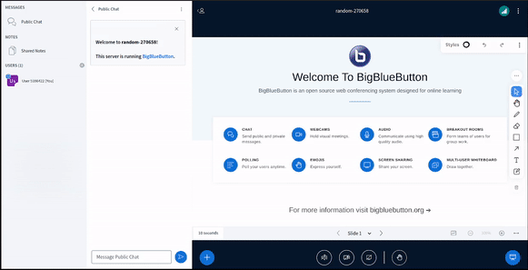

# Sample Whiteboard Toolbar Plugin

## What it does

This plugin is just an example of how developers can create their own plugins. It consists of a button that shows the label "10s" and as soon as you click it, it will turn into a spinner and will open a modal window showing some information about the current presentation and its slide.



## Building the plugin

In order to build it, use the `build-bundle command`.

```bash
cd $HOME/src/bigbluebutton-html-plugin-sdk/sample-whiteboard-toolbar-plugin
npm install
npm run build-bundle
```

It will generate the `dist` folder which contains the bundled js file (in this case called `SampleWhiteboardToolbarPlugin.js`, but you can change this in `webpack.config.js`).

## Using it in your BigBlueButton server

With the bundled plugin, you can install it anywhere you want (for instance: a dedicated server for your plugins `https://<your-dedicated-server>/plugins/SampleWhiteboardToolbarPlugin.js`), just make sure to point it correctly on the `settings.yml`. But for the purpose of just testing it, we are going to install it in the BigBlueButton server, so follow the instructions:

```bash
mkdir /var/www/bigbluebutton-default/assets/plugins
sudo cp $HOME/src/bigbluebutton-html-plugin-sdk/sample-whiteboard-toolbar-plugin/dist/SampleWhiteboardToolbarPlugin.js /var/www/bigbluebutton-default/assets/plugins
```

`settings.yml` configuration:

Next we will change the `settings.yml` file from bbb-html5, and insert the following lines:

```yaml
plugins:
    - name: sampleWhiteboardToolbarPlugin
      url: https://<your-host>/plugins/SampleWhiteboardToolbarPlugin.js
```

alongside with the app directive, just as follows:

```yaml
public:
    app:
      ... // All app configs
    plugins:
        - name: sampleWhiteboardToolbarPlugin
          url: https://<your-host>/plugins/SampleWhiteboardToolbarPlugin.js
    ... // All other configs

```

And there you go, it is already possible to use.

To create a custom Plugin yourself, just follow the general structure of the sample-whiteboard-toolbar-plugin
