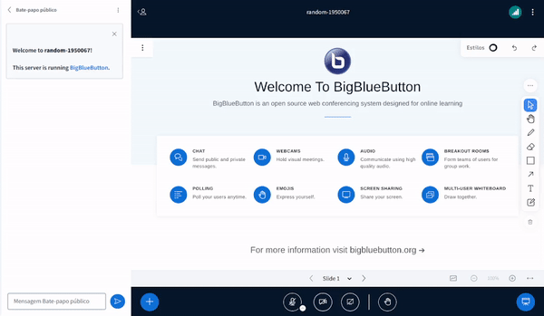

# Sample Audio Settings Dropdown Plugin

## What is it?

The Sample Audio Settings Dropdown Plugin serves as a demonstration of how developers can create their own custom plugins, in this case it goes into the audio settings dropdown. This plugin includes a separator and an option for the user to click. When the user clicks on the option, a log will appear in the console. See example below.



See the **Usage** section of the main README to see how to build and run plugins.

## Configuration Example

Add this to the `settings.yml` of the BBB HTML5-client:

```yaml
public:
  plugins:
    - name: SampleAudioSettingsDropdownPlugin
      url: <<PLUGIN_URL>>
```

Where `<<PLUGIN_URL>>` is the URL that points to the location where your bundled `SampleAudioSettingsDropdownPlugin.js`-file is hosted.
