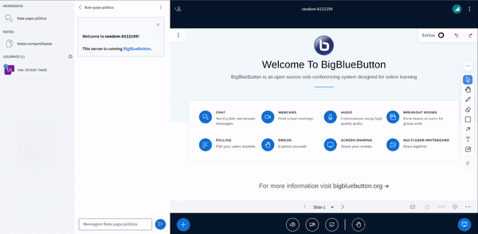

# Sample Camera Settings Dropdown

## What is it?

The Sample Camera Settings Dropdown Plugin serves as a demonstration of how developers can create their own custom plugins. This plugin includes a separator after the ordinary actions menu options and a button. When you click on the button, it will log a message on the console, and then close the menu dropdown.



See the **Usage** section of the main README to see how to build and run plugins.

## Configuration Example

Add this to the `settings.yml` of the BBB HTML5-client:

```yaml
public:
  plugins:
    - name: SampleCameraSettingsDropdownPlugin
      url: <<PLUGIN_URL>>
```

Where `<<PLUGIN_URL>>` is the URL that points to the location where your bundled `SampleCameraSettingsDropdownPlugin.js`-file is hosted.
