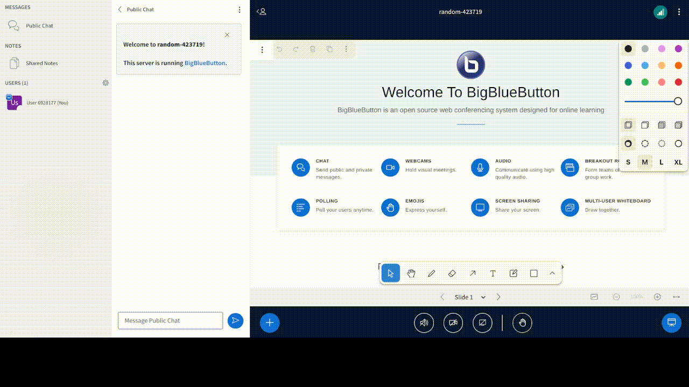

# Sample Dom Item Manipulation Plugin

## What is it?

The Sample Dom Item Manipulation Plugin serves as a demonstration of how developers can create their own custom plugins. This plugin basically implements the "mention" feature as you can see down below.



## Running the Plugin from Source

1. Start the development server:

```bash
cd $HOME/src/bigbluebutton-html-plugin-sdk/samples/sample-dom-element-manipulation
npm install
npm start
```

2. Add reference to it on BigBlueButton's `settings.yml`:

```yaml
  plugins:
    - name: SampleDomElementManipulation
      url: http://127.0.0.1:4701/static/SampleDomElementManipulation.js
```

## Building the Plugin

To build the plugin for production use, follow these steps:

```bash
cd $HOME/src/bigbluebutton-html-plugin-sdk/samples/sample-dom-element-manipulation
npm install
npm run build-bundle
```

The above command will generate the `dist` folder, containing the bundled JavaScript file named `SampleDomElementManipulation.js`. This file can be hosted on any HTTPS server.

To use the plugin with BigBlueButton, add the plugin's URL to `settings.yml` as shown below:

```yaml
public:
  app:
    ... // All app configurations
  plugins:
    - name: SampleDomElementManipulation
      url: <<PLUGIN_URL>>
  ... // All other configurations
```

Alternatively, you can host the bundled file on the BigBlueButton server by copying `dist/SampleDomElementManipulation.js` to the folder `/var/www/bigbluebutton-default/assets/plugins`. In this case, the `<<PLUGIN_URL>>` will be `https://<your-host>/plugins/SampleDomElementManipulation.js`.
