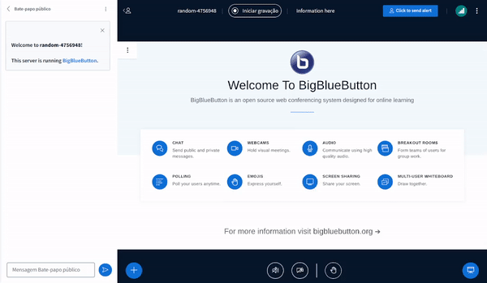

# Sample Nav Bar Plugin

## What is it?

The Sample Nav Bar Plugin serves as a demonstration of how developers can create their own custom plugins. This plugin includes a button. When you click on the button, a log will appear in the console.



See the **Usage** section of the main README to see how to build and run plugins.

## Building the Plugin
```bash
cd $HOME/src/sample-nav-bar-plugin
npm ci
npm run build-bundle
```
The above command will generate the `dist` folder, containing the bundled JavaScript file named `SampleNavBarPlugin.js`. This file can be hosted on any HTTPS server along with its `manifest.json`.

If you install the Plugin separated to the manifest, remember to change the `javascriptEntrypointUrl` in the `manifest.json` to the correct endpoint.

To use the plugin in BigBlueButton, send this parameter along in create call:

```
pluginManifests=[{"url":"<your-domain>/path/to/manifest.json"}]
```

Or additionally, you can add this same configuration in the `.properties` file from `bbb-web` in `/usr/share/bbb-web/WEB-INF/classes/bigbluebutton.properties`
