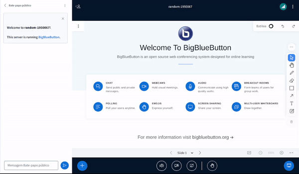

# Sample Presentation Dropdown Plugin

## What is it?

The Sample Presentation Dropdown Plugin serves as a demonstration of how developers can create their own custom plugins, in this case it goes into the presentation dropdown. This sample includes a separator and an option that when you click it, a popup appears with a label that reads "Alert from plugin".



See the **Usage** section of the main README to see how to build and run plugins.

## Configuration Example

Add this to the `settings.yml` of the BBB HTML5-client:

```yaml
public:
  plugins:
    - name: SamplePresentationDropdownPlugin
      url: <<PLUGIN_URL>>
```

Where `<<PLUGIN_URL>>` is the URL that points to the location where your bundled `SamplePresentationDropdownPlugin.js`-file is hosted.
