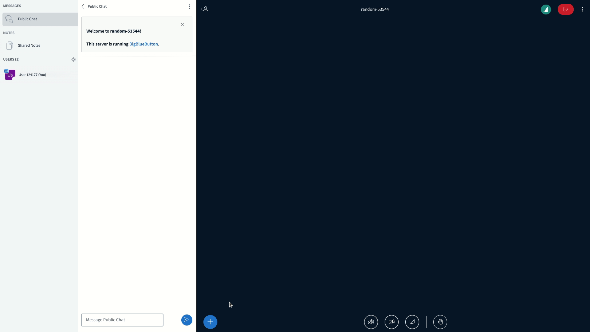

# Sample Server Commands Plugin

## What is it?

The Sample Server Commands Plugin serves as a demonstration of how developers can create their own custom plugins. This plugin includes a button in the actions menu options, that when clicked sends a message in the public chat.



See the **Usage** section of the main README to see how to build and run plugins.

## Configuration Example

Add this to the `settings.yml` of the BBB HTML5-client:

```yaml
public:
  plugins:
    - name: SampleServerCommandsPlugin
      url: <<PLUGIN_URL>>
```

Where `<<PLUGIN_URL>>` is the URL that points to the location where your bundled `SampleServerCommandsPlugin.js`-file is hosted.
