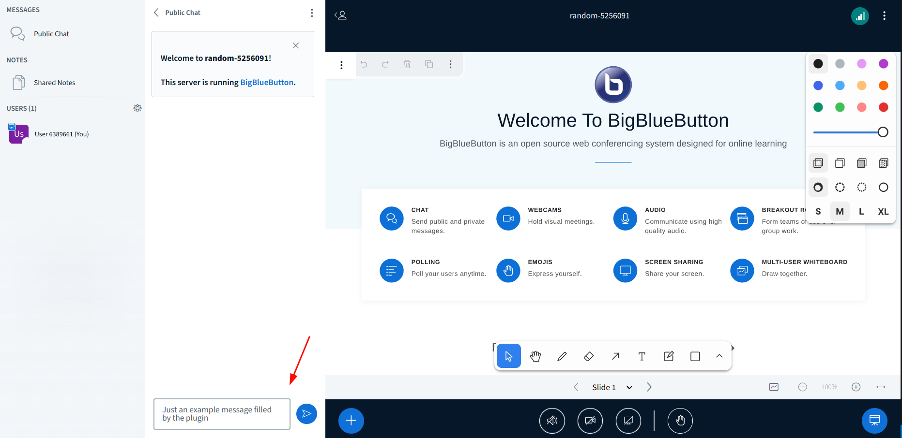

# Sample Ui Commands Plugin

## What is it?

The Sample Ui Commands Plugin serves as a demonstration of how developers can create their own custom plugins. It will simply open the poll creation sidebar content, and will also fill it with it's information (feel free to change it to fit your needs).



## Running the Plugin from Source

1. Start the development server:

```bash
cd $HOME/src/bigbluebutton-html-plugin-sdk/samples/sample-ui-commands-plugin
npm install
npm start
```

2. Add reference to it on BigBlueButton's `settings.yml`:

```yaml
  plugins:
    - name: SampleUiCommandsPlugin
      url: http://127.0.0.1:4701/static/SampleUiCommandsPlugin.js
```

## Building the Plugin

To build the plugin for production use, follow these steps:

```bash
cd $HOME/src/bigbluebutton-html-plugin-sdk/samples/sample-ui-commands-plugin
npm install
npm run build-bundle
```

The above command will generate the `dist` folder, containing the bundled JavaScript file named `SampleUiCommandsPlugin.js`. This file can be hosted on any HTTPS server.

To use the plugin with BigBlueButton, add the plugin's URL to `settings.yml` as shown below:

```yaml
public:
  app:
    ... // All app configurations
  plugins:
    - name: sampleUiCommandsPlugin
      url: <<PLUGIN_URL>>
  ... // All other configurations
```

Alternatively, you can host the bundled file on the BigBlueButton server by copying `dist/SampleUiCommandsPlugin.js` to the folder `/var/www/bigbluebutton-default/assets/plugins`. In this case, the `<<PLUGIN_URL>>` will be `https://<your-host>/plugins/SampleUiCommandsPlugin.js`.
