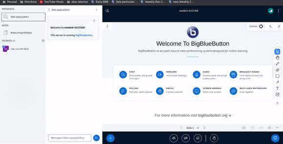

# Sample User List Dropdown Plugin

## What is it?

The Sample Presentation User List Dropdown Plugin serves as a demonstration of how developers can create their own custom plugins, in this case it goes into the user list dropdown of each participant. This plugin includes another option for each user in the user list that displays the label "Click to see participant information". When you click on the button, a modal appears with some information about the user such as name, userId and role in the meeting.



## Running the Plugin from Source

1. Start the development server:

```bash
cd $HOME/src/bigbluebutton-html-plugin-sdk/samples/sample-user-list-dropdown-plugin
npm install
npm start
```

2. Add reference to it on BigBlueButton's `settings.yml`:

```yaml
  plugins:
    - name: SampleUserListDropdownPlugin
      url: http://localhost:8080/static/SampleUserListDropdownPlugin.js
```

## Building the Plugin

To build the plugin for production use, follow these steps:

```bash
cd $HOME/src/bigbluebutton-html-plugin-sdk/samples/sample-user-list-dropdown-plugin
npm install
npm run build-bundle
```

The above command will generate the `dist` folder, containing the bundled JavaScript file named `SampleUserListDropdownPlugin.js`. This file can be hosted on any HTTPS server.

To use the plugin with BigBlueButton, add the plugin's URL to `settings.yml` as shown below:

```yaml
public:
  app:
    ... // All app configurations
  plugins:
    - name: SampleUserListDropdownPlugin
      url: <<PLUGIN_URL>>
  ... // All other configurations
```

Alternatively, you can host the bundled file on the BigBlueButton server by copying `dist/SampleUserListDropdownPlugin.js` to the folder `/var/www/bigbluebutton-default/assets/plugins`. In this case, the `<<PLUGIN_URL>>` will be `https://<your-host>/plugins/SampleUserListDropdownPlugin.js`.
